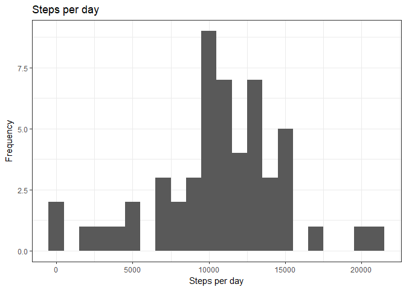
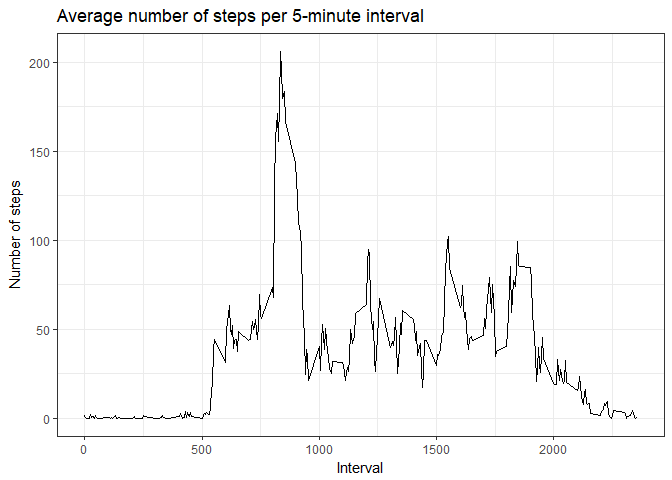
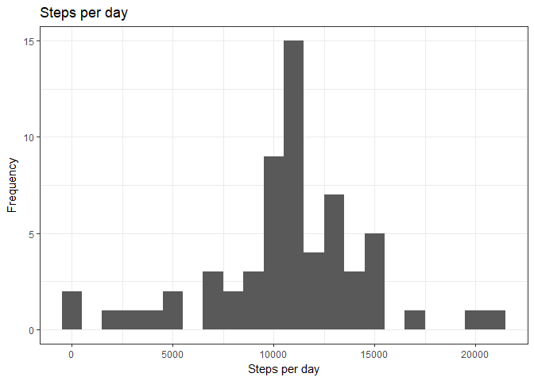
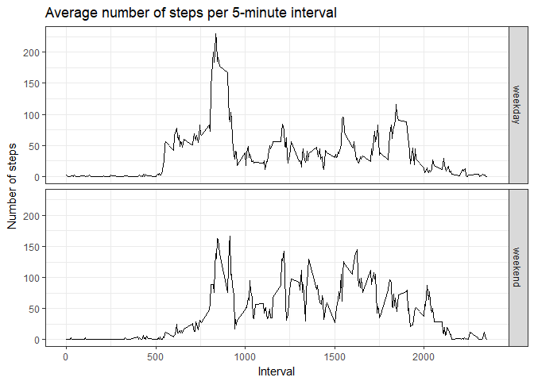

# Reproducible Research: Peer Assessment 1


## Loading and preprocessing the data
The steps and interval columns should be read in as integer columns, while the date column should be read in as a factor column. The date column is converted to the Date class. The data for which steps isn't NA is stored in steps_no_na.

```r
dat <- read.csv("activity.csv")
dat$date <- as.Date(dat$date)
steps_no_na <- dat[!is.na(dat$steps),]
summary(steps_no_na)
```

```
##      steps             date               interval     
##  Min.   :  0.00   Min.   :2012-10-02   Min.   :   0.0  
##  1st Qu.:  0.00   1st Qu.:2012-10-16   1st Qu.: 588.8  
##  Median :  0.00   Median :2012-10-29   Median :1177.5  
##  Mean   : 37.38   Mean   :2012-10-30   Mean   :1177.5  
##  3rd Qu.: 12.00   3rd Qu.:2012-11-16   3rd Qu.:1766.2  
##  Max.   :806.00   Max.   :2012-11-29   Max.   :2355.0
```

## What is mean total number of steps taken per day?
The ggplot2 library's qplot() will be used for plotting. The function tapply() is used to sum steps across each day. The number of steps per day is then plotted as a histogram.

```r
library(ggplot2)
summary(steps_no_na)
```

```
##      steps             date               interval     
##  Min.   :  0.00   Min.   :2012-10-02   Min.   :   0.0  
##  1st Qu.:  0.00   1st Qu.:2012-10-16   1st Qu.: 588.8  
##  Median :  0.00   Median :2012-10-29   Median :1177.5  
##  Mean   : 37.38   Mean   :2012-10-30   Mean   :1177.5  
##  3rd Qu.: 12.00   3rd Qu.:2012-11-16   3rd Qu.:1766.2  
##  Max.   :806.00   Max.   :2012-11-29   Max.   :2355.0
```

```r
steps_per_day <- tapply(steps_no_na$steps, steps_no_na$date, sum)
summary(steps_per_day)
```

```
##    Min. 1st Qu.  Median    Mean 3rd Qu.    Max. 
##      41    8841   10765   10766   13294   21194
```

```r
qplot(steps_per_day, binwidth=1000) +
  xlab("Steps per day") +
  ylab("Frequency") +
  ggtitle("Steps per day") +
  theme_bw()
```

<!-- -->

The mean and median steps per day are calculated.

```r
mean(steps_per_day)
```

```
## [1] 10766.19
```

```r
median(steps_per_day)
```

```
## [1] 10765
```

## What is the average daily activity pattern?
The average number of steps is calculated for each 5-minute interval. The averages for all intervals are plotted using qplot().

```r
interval_means <- tapply(steps_no_na$steps,steps_no_na$interval,mean)
qplot(x = as.integer(names(interval_means)), y = interval_means, geom = "line") +
  xlab("Interval") +
  ylab("Number of steps") +
  ggtitle("Average number of steps per 5-minute interval") +
  theme_bw()
```

<!-- -->

The interval with the most steps on average is found.

```r
max(interval_means)
```

```
## [1] 206.1698
```

```r
names(interval_means)[interval_means == max(interval_means)]
```

```
## [1] "835"
```

## Imputing missing values
The number of NA values is found.

```r
nrow(dat) - nrow(steps_no_na)
```

```
## [1] 2304
```

Missing values will be imputed using the interval means.

```r
dat2 <- dat
dat2[is.na(dat2$steps),1] <- interval_means[as.character(dat2[is.na(dat2$steps),3])]
summary(dat)
```

```
##      steps             date               interval     
##  Min.   :  0.00   Min.   :2012-10-01   Min.   :   0.0  
##  1st Qu.:  0.00   1st Qu.:2012-10-16   1st Qu.: 588.8  
##  Median :  0.00   Median :2012-10-31   Median :1177.5  
##  Mean   : 37.38   Mean   :2012-10-31   Mean   :1177.5  
##  3rd Qu.: 12.00   3rd Qu.:2012-11-15   3rd Qu.:1766.2  
##  Max.   :806.00   Max.   :2012-11-30   Max.   :2355.0  
##  NA's   :2304
```

```r
summary(dat2)
```

```
##      steps             date               interval     
##  Min.   :  0.00   Min.   :2012-10-01   Min.   :   0.0  
##  1st Qu.:  0.00   1st Qu.:2012-10-16   1st Qu.: 588.8  
##  Median :  0.00   Median :2012-10-31   Median :1177.5  
##  Mean   : 37.38   Mean   :2012-10-31   Mean   :1177.5  
##  3rd Qu.: 27.00   3rd Qu.:2012-11-15   3rd Qu.:1766.2  
##  Max.   :806.00   Max.   :2012-11-30   Max.   :2355.0
```

As above, the number of steps per day is calculated and plotted.

```r
steps_per_day2 <- tapply(dat2$steps, dat2$date,sum)
qplot(steps_per_day2, binwidth=1000) +
  xlab("Steps per day") +
  ylab("Frequency") +
  ggtitle("Steps per day") +
  theme_bw()
```

<!-- -->


```r
mean(steps_per_day2)
```

```
## [1] 10766.19
```

```r
median(steps_per_day2)
```

```
## [1] 10766.19
```

Note that the mean is unchanged. The eight days for which step data was NA ended up being imputed as having the average number of steps per day. Since those eight days contained only NA values and were ignored previously, and no NAs occurred outside of those eight days, the net result is that the mean steps per day was unchanged but other values such as the median and quartiles were changed. Compared to the original data, the mean is represented more in the imputed data.

## Are there differences in activity patterns between weekdays and weekends?
Data are categorized based on whether they were taken on a weekday or weekend.

```r
day_cat <- function(in_date) ifelse((in_date == 0 | in_date == 6),"weekend","weekday")
dat2$day_category <- day_cat(format(dat2$date,"%w"))
dat2$day_category <- as.factor(dat2$day_category)
dat2[c(1,1441),]
```

```
##         steps       date interval day_category
## 1    1.716981 2012-10-01        0      weekday
## 1441 0.000000 2012-10-06        0      weekend
```

The average number of steps is again calculated for each 5-minute interval. This time, the average is calculated separately for weekdays and weekends. The averages for all intervals are plotted using qplot().

```r
ggplot(data = dat2, aes(y=steps, x=interval)) +
  stat_summary(fun.y = "mean", geom="line") +
  xlab("Interval") +
  ylab("Number of steps") +
  ggtitle("Average number of steps per 5-minute interval") +
  facet_grid(day_category ~ .) +
  theme_bw()
```

<!-- -->
